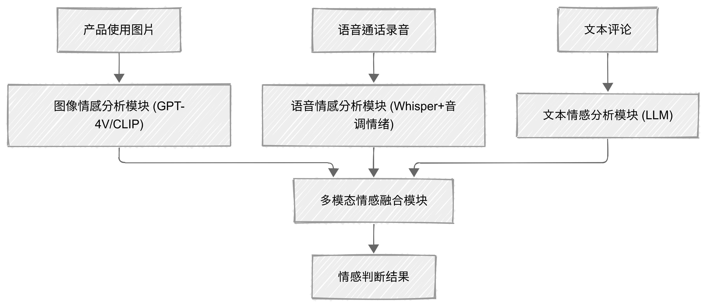

# 目录

- [TASK 1: Customer Churn Prediction Model](#task-1-customer-churn-prediction-model)
- [TASK 2: Anomaly Detection System](#task-2-anomaly-detection-system)
- [TASK 3: RAG Chatbot](#task-3-rag-chatbot)
- [TASK 4: Multimodal Sentiment Analysis System](#task-4-multimodal-sentiment-analysis-system)

---

# TASK 1: Customer Churn Prediction Model

## 1. 数据概览

###  客户总体流失情况

- 流失率约为 30%
- 数据集共1000条样本

### 特征基本分布情况

#### 性别
  
#### 余额水平

#### 收入
  
#### 满意度得分

#### 投诉记录

#### 支付延迟

### PCA 客户分布

 

- 客户流失在降维空间中未形成明显聚类，说明流失行为并非由单一线性因素主导；
- 主成分累计解释率仅为 27%，说明原始数据结构较复杂

## 2. 特征工程

**清洗处理**：
- 缺失值/重复值处理：原始数据中无该情况
- 异常值处理：对`tenure_month`做clip，限制其最大值为100个月
- 分类变量编码：One-Hot编码
- 数值变量变换：对 `income` 做对数转换
- 分箱处理：对`account_balance`,`payment_delays_6m`,`service_calls_6m`做分箱

**新增特征：**

| 特征名 | 说明 |
|--------|------|
| `balance_income_ratio` | 余额占收入比例 |
| `balance_satisfaction` | 余额 × 满意度|
| `monthly_spend` | 月交易次数 × 均值|

## 3.模型训练
为确保模型具备稳定性和泛化能力，在训练过程中采用了以下策略：
- 使用 GridSearchCV对每个模型进行系统性超参数调优；

- 所有模型训练均使用 StratifiedKFold 分层抽样的 10 折交叉验证，确保在不同样本划分下性能稳定；

- 对于样本不平衡的问题，部分模型（如 Random Forest、Logistic Regression）通过设置 class_weight，以及对正负样本权重进行调整（如 XGBoost、LightGBM 中的 scale_pos_weight）以提高召回能力；

## 4. 模型比较与评估结果

以下为各模型在测试集下的最佳阈值下评估指标对比：

（以 F1 Score 与 ROC-AUC 为主要综合指标）

| Model               | Best Threshold | Precision | Recall | F1 Score | ROC-AUC |
|--------------------|----------------|-----------|--------|----------|---------|
| Random Forest       | 0.315          | 0.403     | 0.878  | 0.552    | 0.706   |
| Logistic Regression | 0.183          | 0.389     | **0.911**  | 0.545    | 0.696   |
| XGBoost         | 0.497          | **0.481** | 0.722  | **0.578**| **0.722**|
| LightGBM            | 0.453          | 0.447     | 0.789  | 0.570    | 0.710   |

- XGBoost 综合性能最优，F1 Score 与 ROC-AUC 均领先，适合作为生产模型；
- Logistic Regression 的recall 表现最好，适合用于前置风险筛查；
- Random Forest 在 Recall 上也很强（0.878），但 Precision 较低，可能带来更多误报；
- 所有模型的ROC-AUC在0.69-0.73之间，对流失客户识别稳定，可辅助后续营销运营。

## 5. 特征重要性分析

### XGBoost 特征重要性图

### Logistic Regression 系数方向图

| 关键变量 | 影响方向 | 解读 |
|----------|----------|------|
| `satisfaction_score` | 越低越易流失 | 顾客体验至关重要 |
| `balance_satisfaction` | 越低越易流失 | 低余额 + 不满意 是典型风险群体 |
| `complaints_6m` | 有投诉显著提升流失概率 | 服务质量直接影响忠诚度 |
| `payment_delay_level` | Repeated Delay 表现为高风险 | 支付不规律是预警信号 |

---
# TASK 2: Anomaly Detection System

## 技术实现思路

### 1. 数据处理与特征工程

- 时间同步、异常值修正、归一化
- 滑动窗口处理，构造时序结构
- Rolling 统计特征：均值、方差、变化率等
- 对深度模型可直接输入原始窗口序列

### 2. 异常检测算法

#### 无监督方法
- **Isolation Forest**（适合高维稀疏异常场景）
- **AutoEncoder**（重构误差高即为异常）
- **LSTM-VAE**（时序 + 潜变量检测，适合捕捉时间依赖性）

#### 半监督方法
- **One-Class SVM**（学习正常样本的边界）
- **AutoEncoder + 利用标注数据微调检测阈值**
- **模型集成策略**（多模型得分融合 + 异常标签调参）

### 3. 异常解释能力

- **Isolation Forest** → 使用 SHAP 值分析特征贡献
- **AutoEncoder** → 输出每个特征的重构误差
- **LSTM-VAE + Attention** → 注意力权重高的时间步或特征可用于识别主要异常来源

### 4. 阈值优化与评估

- 使用稀疏标注异常进行 F1-score 优化
- 支持动态阈值（如基于重构误差分布自动调整）
- Precision vs Recall平衡，控制误报率

### 5. 相关工具与平台

| 类型 | 工具 | 说明 |
|------|------|------|
| Python库 | PyOD | 支持几十种检测算法，统一接口，适合快速迭代 |
| 云服务 | AWS Lookout for Equipment | 工业传感器专用，开箱即用，无需建模 |
| 云服务 | Azure Anomaly Detector (Multivariate) | 多变量建模、自动学习相关性，适合部署到 Azure 平台 |

## 参考资料

- [PyOD - Python Outlier Detection](https://pyod.readthedocs.io/en/latest/)

- [AWS Lookout for Equipment](https://aws.amazon.com/lookout-for-equipment/)
- [Azure Anomaly Detector](https://learn.microsoft.com/en-us/azure/cognitive-services/anomaly-detector/)
- [LSTM-VAE Anomaly Detection 论文](https://arxiv.org/abs/1903.02407)
- [SHAP Explainability](https://shap.readthedocs.io/en/latest/)

---

# TASK 3: RAG Chatbot

## 1. 系统架构
- **前端界面**：使用 `Streamlit`构建，提供聊天 UI、侧边栏控件（控制查询扩展、重排序、索引管理）
- **后端框架**：LangChain+Python
- **RAG 处理流程（智能检索触发）**：
  - Step 1: LLM 先对用户意图进行分析，判断是否需要调用知识库
  - Step 2: 若需要，执行 Query Expand + 混合检索 + 可选重排序
  - Step 3: 将文档注入上下文，调用 LLM 生成回答
  - Step 4: 若不需要知识库，LLM 直接基于自身知识生成快速响应

- **系统演示**：
[▶️ 点击查看系统演示视频](video/ragchatbot.mp4)

## 2. 文档预处理

- **原始格式**：PDF 格式的[技术手册](https://support.industry.siemens.com/cs/cn/zh/view/109767345)和[常见问题文档](https://www.ad.siemens.com.cn/productportal/prods/V90_Document/00_Selection/06_FAQ/SelectionFAQ.htm)
- **转换工具**：使用 [LlamaParse](https://cloud.llamaindex.ai/project/9b763bc0-8014-43f7-9128-0f5be4d64ddf/pipeline) 将 PDF 转为结构化 Markdown 文件
- **切块策略**：基于 Markdown 层级结构划分，使用 LangChain的`MarkdownHeaderTextSplitter`：
  - `#` 为一级标题
  - `##` 为二级标题
  - 过滤掉仅包含标题或无实际内容的块

## 3. 向量索引与嵌入

- **嵌入模型**：`BAAI/bge-small-zh-v1.5`，支持中文，运行于 CPU
- **向量索引**：使用 `FAISS`本地构建和保存
- **稀疏索引**：基于 `rank_bm25.BM25Okapi` 实现 BM25 检索器
- **混合索引策略**：利用 LangChain 的 `EnsembleRetriever` 加权组合 BM25 与 FAISS 向量检索

## 4. 智能检索触发机制
- 对于常识性、开放性问题（如：“你是谁？”，“介绍一下西门子”），LLM 将直接回答，无需文档检索
- 对于依赖文档细节的问题（如：“1FL6 新旧型号有什么区别？”），LLM 将主动调用知识库进行检索、引用并生成回答

## 5. 检索策略

- **查询扩展**：启用后，使用 LLM 从用户提问中识别关键术语并生成相关术语组合查询，提升召回率
- **文档检索流程**：
  - 使用 BM25 与 FAISS 混合检索相关文档块
  - 可启用 Cohere Rerank API 对结果进行重排序
  - 按文档相关性得分生成置信度评级（高 / 中 / 低）

## 6. 回答生成

- **语言模型**：使用 DeepSeek-v3 API
- **上下文注入方式**：将 Top N 文档块（含引用和置信度）拼接后注入 prompt 中，辅助生成

---
# TASK 4: Multimodal Sentiment Analysis System

## 技术实现思路

### 1. 文本情感分析模块
- 可直接利用预训练的中文情感分析模型（如基于BERT/ERNIE的模型）或调用 GPT-4 等大模型的API进行情感判断。
- 如果使用GPT-4 API，可以将文本作为输入，让模型返回情感极性和相关的置信度/理由。
- 本模块输出文本评论的情感标签和置信度，并标注关键情感词（用于解释说明）。

### 2. 语音情感分析模块
-  **语音转文本（ASR）：** 使用 OpenAI Whisper 将语音转录为文本。Whisper 模型在中英文语音识别上效果出色，可本地部署（如使用Whisper.cpp优化推理）或使用云端API进行转写。
-  **语音内容情感分析：** 对转写的文本应用文本情感模型（可复用上述文本情感分析模块），得到言语内容的情感倾向。
-  **声音语调情绪分析：** 提取音频的声学特征（如音调、能量、语速）以检测说话者情绪。例如，可使用预训练的语音情绪识别模型（如基于Wav2Vec2的大模型）判断音频情绪状态（愤怒、开心等）。
-  **综合输出：** 将文本内容情感与语音语调情绪融合得到语音通话的情感结论。例如，如果文本转写内容和声调分析均显示负面，则判定负面；若出现不一致，本模块标记冲突并输出两种结果供融合阶段处理。模块还定位语音中影响情感判断的片段时间轴（如检测到激动提高音量的片段）。

### 3. 图像情感分析模块
- 利用多模态模型对图片进行语义理解，如使用 GPT-4V (GPT-4 Vision) 分析图像内容。GPT-4V 能对图像进行描述和推理，可用于判断图像所传达的情绪（例如用户表情是微笑还是皱眉，产品是否完好等）。
- 或采用开源视觉模型：使用 CLIP 提取图像的语义特征，将图片内容描述为文本标签，再对这些标签或描述执行情感分析；或者使用ViT等视觉Transformer模型 fine-tune 后直接分类图像所表达的情感。
- 如果图像包含人脸，可叠加人脸表情识别算法，获取人物情绪（如开心、沮丧）辅助判断。(Azure Face API/AWS Face Recognition)
- 模块输出图像情感结果、置信度，并可定位影响判断的图像区域（例如标出人物表情所在位置或图片中突显情绪的关键物体区域，以辅助解释）。

### 4. 多模态融合策略
- **融合方式：** 采用后期融合（Late Fusion）策略：即先分别获得文本、语音、图像的情感分类结果及证据，再综合决策。这样可以充分利用预训练模型，无需从零训练多模态模型。融合算法可以简单规则投票，也可以利用模型（如决策树或小型神经网络）学习各模态权重。
- **不一致性处理：** 当不同模态给出矛盾的情感信号时，融合模块需要处理冲突。例如文字内容积极但语音语调消极的情况，可能表示用户言辞积极但语气讽刺不满。解决方案是引入权重或策略：根据历史经验或置信度调整各模态贡献，必要时以语音情绪等更直接信号为准；或者将冲突情感标记为“混合/矛盾”，并在结果中反馈不确定性。采用GPT-4模型融合时，可将各模态信息（文本内容及其情感、语音语气描述、图像描述及情感）一起输入，让其生成综合判断和解释，GPT-4能够基于上下文自动权衡冲突并给出合理的结论。

## 参考资料

- [Audio Sentiment Analysis](https://research.aimultiple.com/audio-sentiment-analysis/)

- [深入理解多模态情感分析：CMU-MOSI与CMU-MOSEI的实践探索](https://cloud.baidu.com/article/3330068)

- [AWS Face Recognition](https://docs.aws.amazon.com/rekognition/)